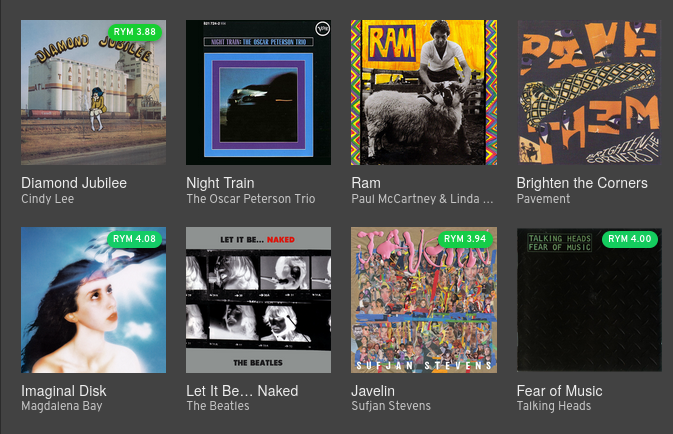

# Comping

**Comping** is a browser extension that displays ratings from RateYourMusic and Glitchwave as overlay badges on other websites like Spotify, YouTube, and more.

⚠️ This is an unofficial extension. Use may violate RateYourMusic's Terms of Service. Use at
your own risk.

## Platform Support

### 🎵 Music

- **Spotify**: Album cards and track listings on artist, album, and playlist pages
- **YouTube**: Video titles and channel pages
- **Last.fm**: Artist pages, album listings, and track charts
- **Navidrome** (Self-hosted): Album cards, track listings, artist pages

### 🎬 Movies

- **Jellyfin** (Self-hosted): Movies tiles

### 🎮 Video Games

- **Steam**: Game store pages
- **Humble Bundle**: Bundle pages

## ⚡ Features

- **Automatic caching**: Syncs ratings from RateYourMusic and Glitchwave while you browse them in your local storage
- **Color-coded ratings**: Visual gradient from red (low) to green (high)
- **Click-through links**: Click any badge to visit the full review page on the source website

## Installation

Download the latest release from the [releases page](https://github.com/dbeley/comping/releases).

## How It Works

### 1. Data Collection

Visit any supported website:

- [RateYourMusic](https://rateyourmusic.com) for music and movies
- [Glitchwave](https://glitchwave.com) for video games

The extension automatically extracts and caches rating data from these sites as you browse those websites.

### 2. Data Storage

All data is stored locally in your browser using the WebExtensions Storage API. Nothing is sent to external servers.

### 3. Overlay Display

When you visit supported platforms (Spotify, YouTube, etc.), Comping:

- Detects album/track/movie/game titles
- Looks up cached ratings
- Displays color-coded badges with ratings

## Configuration

Click the Comping icon in your browser toolbar to:

- **Enable/disable data sources**: Choose which data to cache
- **Toggle overlays**: Enable/disable specific platform integrations
- **Refresh cache**: Manually trigger a cache update
- **Export data**: Download your cached ratings as CSV

## Privacy

- **100% local**: All data stays in your browser
- **No tracking**: No analytics, no telemetry, no external servers
- **No accounts**: No sign-up required
- **Open source**: All code is available for review

## Contributing

Contributions are welcome! Feel free to:

- Report bugs
- Suggest new features
- Add support for new platforms
- Improve documentation

## Credits

Inspired by the jazz tradition of "comping" - providing thoughtful accompaniment that enhances without overwhelming.

Data sources:

- [RateYourMusic](https://rateyourmusic.com/)
- [Glitchwave](https://glitchwave.com/)
